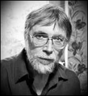

__Vladimir Martynov__ is a Russian composer, born on February 20, 1946 in Moscow, known for his music in the Concerto, Orchestral Music, Chamber Music and Choral Music genres. 
Vladimir Martynov is a leader of the generation of composers of the Soviet Union, born after World War II, who pursued avant-garde courses at a time when official disfavor of such styles brought severe penalties to career development, but did not carry the physical risks of earlier years in the USSR. He studied piano as a child and gained an interest in composition. Vladimir Martynov enrolled in the Moscow Conservatory where he studied piano under Mikhail Mezhlumov and composition under Nikolai Sidelnikov, graduating in 1971. 
In his early works, such as the String Quartet (1966), the Concerto for oboe and flute (1968), Hexagramme for piano (1971), and Violin sonata (1973), Vladimir Martynov used serial music (or twelve-tone) technique. In 1973 he got a job at the studio for electronic music of the Alexander Scriabin Museum. For Soviet composers of this era, this studio had much the same meaning as the RAI Electronic Music Studio in Milan, the West German Radio studio, and the ORTF Studio in Paris, providing a meeting ground for the avant-garde musicians. Sofia Gubaidulina, Sergei Nemtin, Alfred Schnittke, and Edison Denisov were among the composers regularly working and meeting there. 
Martynov helped to form a rock group called Boomerang at the Scriabin Studio. For them he wrote a rock opera Seraphic Visions from St. Francis of Assisi (1978). 
Vladimir Martynov is also known as a serious ethnomusicologist, specializing the music of the Caucasian peoples, Tajikistan, and other ethnic groups in Russia. He also studied medieval Russian and European music, as well as religious musical history and musicology. While even at Soviet times this field of study was considered generally acceptable, it also allowed him to study theology, religious philosophy and history. Vladimir Martynov began studying early Russian religious chant in the late 1970s; he also studied Renaissance music of such composers as Machaut, Gabrieli, Isaac, Dufay, and Dunstable, publishing editions of their music. He became interested in the brand of minimalism developing in the Soviet Union in the late 1970s: a static, spiritually-inspired style without the shimmering pulse of American minimalism. The timeless quality of chants and the lack of a sense of bar lines in Renaissance polyphony entered into his version of minimalism. 
At about this time, he began teaching at the Academy of Trinity Lavra of St. Sergius in Sergiyev Posad.[4] There was a period of consolidation in the early 1980s where he wrote music specifically tailored for use in church services, then resuming writing original music in his minimalist style. Among his works from this period is Come in! for violin and ensemble of 1988 which was performed by Gidon Kremer and by the composer's partner, Tatiana Grindenko. 
Since the fall of the Soviet Union, he has written works that take on large Christian themes, such as Apocalypse (1991), Lamentations of Jeremiah (1992), Magnificat (1993), Stabat Mater (1994), and Requiem (1998). One of his major compositions is a nearly hour-long piece called Opus Posthumum (1993), devoted to the idea that "a man touches the truth twice. The first time is the first cry from a new born baby's lips and the last is the death rattle. Everything between is untruth to a greater or lesser extent." He also composed a much shorter Opus Prenatum and a work called Twelve Victories of King Arthur for Seven Pianos (1990). 
He has recordings on Le Chant du Monde's imprint "Les Saisons Russes" and on the Moscow based independent label LongArms Records. In 2009 London Philharmonic gave the world premiere of his opera Vita Nuova. The opera premiered in the U.S. at the new Alice Tully Hall on February 28, 2009. 
Vladimir Martynov has authored several books and seminal articles on musical theory, history and philosophy of music. 
