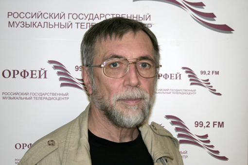
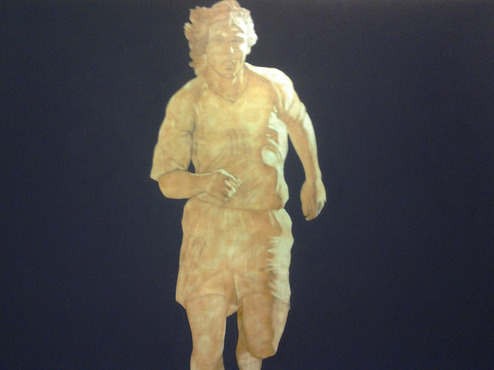

"Fashion comes and goes, but style is eternal" - the great Coco Chanel said. Today we can positively say that composer Vladimir Martynov became not only a trend-setter of contemporary art - he will definitely remain a part of the contemporary history of music. Cycle of meetings with searching philosopher of our times is a unique possibility to join the ideas of Martynov, sometimes very extravagant ones, but make own assessment of the recent cultural phenomena. There are three reasons to come to the event.

First, Vladimir Martynov is author of not only much talked-of theory of "the end of time of composers" which in due course blew up the musical community and split it into two quarreling camps but also a new artistic chronology according to which we are now living in era of "opus post". During the cycle the author tells us about his researches, books and music works and translates his own ideas which is, say, much more interesting than crowds of words all alone. This charismatic guide will not allow you wander at the illimitable space of music history. Vladimir Martynov is very interesting to listen to and he is really large-minded erudite. At the first meeting he enthusiastically told about what at all music is, how Pythagoras opened numerical relations of sounds and what types of musical minimalism are there in the world.

__Vladimir Martynov:__ *"Music is harmonic correlation of human consciousness and reality, but not his or that work. According to Pythagorean doctrine there are three types of music: Musica mundana, Musica Humana and Musica instrumentalis, which mean global music, human music and instrumental music. The universe was considered by Pythagoreans to be a wonderfully organized music instrument emitting perfect sounds which we are not able to hear due to our imperfectness. What does sound in space? Harmonic correlation of planets. According to Pythagoras the four elements - earth, water, fire and air - correlate by music intervals such as: octave, quart, quint and major second. Those days people thought that sound is a constructing unit of space. Right extraction of sounds approximates us to possibility to hear the music of space".*

Second, after his story the author himself executes his works thus contributing to exclusive nature of the event. It's rear story to hear the composition in the form intended by the author. Existing records nevertheless lack the energy which can be felt only staying in the concert hall. Concerts of Vladimir Martynov always bear atmosphere of hierurgy. An interesting fact is connected to this. In 1973 astronomers predicted catastrophe connected to the fact that our planet will be in the zone of cometary tail. To prevent the collapse Martynov wrote *Protection from the comet Kohoutek* executed in the Union of Composers and became averter against the doomsday. Soon the inhabitants of the Earth learnt that gravitation of Jupiter changed trajectory of the planet movement. After the unusual piece implemented its task the composer burnt the notes. Vladimir Martynov's immersion into himself and detachment from everything vain during execution of his works makes listen to them with special thrill.

__Vladimir Martynov:__  *"Today music represents the sphere of entertainment but actually the music is hierurgy. In ancient times, before Pythagoras, the Babylon and Egypt temples allowed to execute music only to special people because it was a consecrated act. We have seven notes. One can ask - why seven? First, there are seven planets in astrology. Accordingly, music is directly connected to astrology. Second, seven heavens, third, seven human chakras. Pressing this or that note we not only emit sound, we appeal to cosmic beginning. This is a huge responsibility. Possibly, the troubles of contemporary community lie in the fact that we irresponsibly take the liberty of executing music.”*

 At the meeting on April 19th Vladimir Martynov executed his composition for piano *Wall-message* written in 2007. According to the composer, "a wall of misunderstanding irreversibly arising between the person and reality is a sign of old, departing world. Hail the new world, and this mysterious exudation of contours of the new world at the worn-out surface of the old one is the essence of transformation of wall of misunderstanding into wall of communication. The wall becomes a clean white surface where the new reality leaves its sign, and the human being himself shall become this clean surface open to perceive the unknown future."

The harmonic field of *Wall-message* represents a continuous pulsation of minor. Velvet waves of sounds give birth to free association. The memory brings forth the last pictures of *The Hours*, film about Virginia Woolf, and words from her suicide note: "Always the years between us. Always the years. Always the love. Always the hours..." It's no coincidence. The phantom of American minimalism of Philip Glass, author of soundtrack for *The Hours* now and then appears in Martynov's works. Sophisticated sorrow and grief about irreversible past is felt in the music from the very first notes. Special tragedy can be felt in the final section where the tense dialog cadence turn and stubborn lonely sound which longly tries to run through agglomerate of conventionalities, overcome fatal fate. The work lasts as long as forty minutes and not paused even once - the real endurance test for executor Martynov handled with honor and dignity of Olympic champion.

The third reason to visit lecture by Vladimir Martynov is the following. The cycle of meetings is intendedly titled *Vita Nova.* In 2009 London Royal Festival Hall hosted the first and only execution of three-act opera *Vita Nova* by Vladimir Martynov based on Dante works. The prehistory is the following: in the very beginning of 2000-s Bolshoi and Mariinsky theaters being eternal rivals to be called the main theater of the country ordered operas to two contemporary composers. Bolshoi - to Saint-Petersburg-based Leonid Desiatnikov the composition of whom was then longly discussed by cultural community. But the Bolshoi Theater implemented its liabilities and made production of *The Children of Rosenthal.* Mariinka chose the Moscovite Vladimir Martynov, and finally *Vita Nova* appeared which according to different reasons didn't see the full-fledged staging. This year the composer decided to stage the work in Moscow. It will be presented in the frames of the cycle. The author confesses: "This opera is about history of opera as the most important genre of European culture."

All meetings will include topical artistic expositions of contemporary artists the pictures of whom can be purchased at the quiet auction. The first evening supported by the Private Non-Profit Cultural Establishment Sistema Gallery included demonstrations of large pictures styled as metaphysical painting of Giorgio de Chirico. Huge figures of picture characters torn out by the beam of light from the darkness and chaos brought third dimension to everything happening in the hall. As it they wanted to escape from canvas and rush to the future anticipating time.

___Elena Kravtsun___  
<http://www.muzcentrum.ru/news/2012/04/item6230.html>
