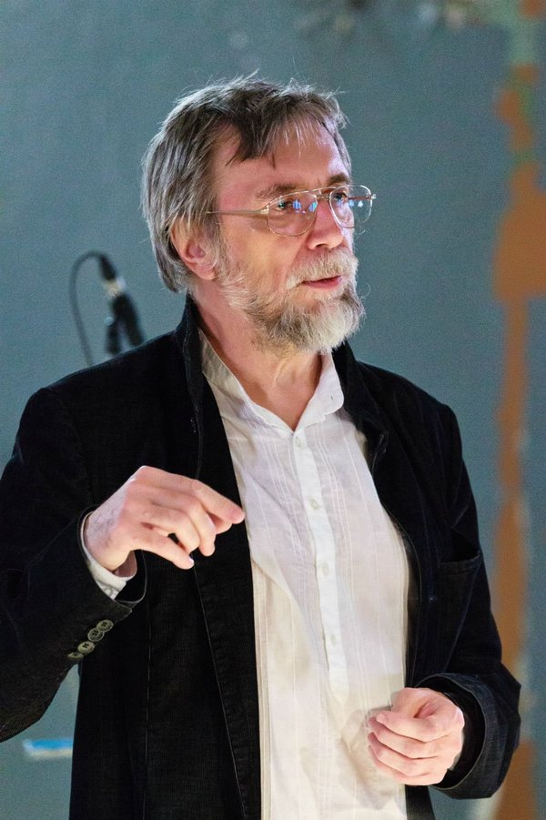
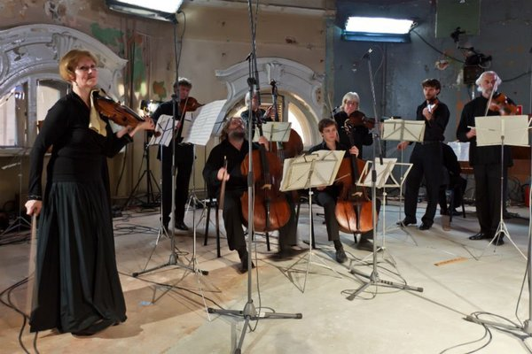

<b>Ekaterina Kholm. Classic music is a disease</b>

Based on materials from planeta.ru 

<i>Before the presentation of opera Vita Nova the Planeta portal met Ekaterina Kholm, director of Sistema Gallery and author of Vita Nova cycle consisting of meetings with Vladimir Martynov. We spoke about issues of popularization of creative work, about death of classic music and about what the visitors can see on 25th day in the Tower of the First Moscow Telephone Station.</i>

<figure>
  
  <figcaption>Vladimir Martynov</figcaption>
</figure>

<b>How did idea come to you mind to cooperate with Vladimir Martynov? Why him?</b>

When I read all books by Martynov I realized from readers' letters addressed to him that he is alive! It was really exciting to realize that there is live man who took the burden to write his thoughts about today's interesting state of things in art and generally in life of contemporary human. Of course, I immediately realized that I want to listen to his music; I ordered the discs at the website and my joy became even brighter. The idea of cooperation didn't come to my mind. I just had acute feeling that I need to share all I heard and learnt with real world, grant my experience to others. Whatever it is called - a civil act, cooperation - but I just had such an "itch to share" as Tatiana Grindenko (famous violinist, founder of Opus Posth ensemble, wife of Vladimir Martynov - Planeta.ru) called it later. And she still has this "itching".

To some degree Martynov became a kind of musical follower of Kierkegaard and Nietzsche for me, and when I started to communicate with him, my passive self-observation became active. Finally, all we do is self-cognition. Along with the fact that Vladimir Ivanovich is himself a cultural phenomenon he speaks in jest, you feel comfortable with him. And sense of humor is just everything to me! And around it the picture of cultural phenomenon takes shape.

<b>Why do people need Martynov?</b>

I think we shall help them to make step from the virtual world they live in. Words are insufficient. Human being perceived with some other organs. That is why we need music which is self-explanatory. There is something available for Martynov to share. And that was the reason to start the cycle. I realize that I'm just a tool, a tool with money and understanding. I had money - and decided to make it.

<b>Is this a mission - to bring Martynov's music to common person?</b>

No. Why mission?! Just Martynov is really an exceptional phenomenon. And no other person can influence our vacuum and virtual world imposed by our time. Of course, one can live inner life but it deprives the human being of action, makes him amorphous because virtuality deprives of gut feeling of reality, grip, some normal instincts. You can read books but one thing is when you read and understand and the other thing is when it comes into you. As, for example, with music. And every work of Martynov returns person to himself. His music has many repetitions as well as any practice - religious or magic - has repetition element when you start listening to yourself. Martynov's methods are archaic; it is deep; it's very old. And the things he does in opera - echoes chant, gregorian chant demonstrating nonlinearity of the music - submerses person into other perception of time, into state of "himself".

And there is no such music anywhere. Conservatories are empty and dull. I was born to musical family; I listen to and play music from the age of 5 but I don't want to go there. Classic music executed there is a disease, a branch of normal music because it is based on vectorial sense of time. The man is outweared, brought to catharsis; he sits deep in his feelings, submerges into ecstatic state and finally receives full devastation. This is senseless. It is impossible to go there. And why should I - to have new feelings, self-denudation? It is impossible to listen to classical music. Bach and Mozart are possible, but even not all. I think if you make an experiment and execute heartrending music by Rachmaninoff , Shostakovitch and then gregorian chant you will see how the perception changes. We are so tortured by the music; we hear it everywhere - in taxis, cafes; but this is a magic act. Earlier it was a thing of initiates, acted to give harmony to human being. And Martynov has purity without intellectual burden of the joy.

<b>Why did the idea appear about the Tower of the First Moscow Telephone Station?</b>

I don't know, as usual. It just appeared following some regularity. I just walked near the building and realized - this is the temple of art! It stands and breaks down. There was nothing for 7 years, just ruins. I was very lucky to know person who owned the building and thought: if there is such a building in Moscow why shall we look or construct something on purpose? No repairs are even necessary; we shall just remove debris.

<b>What about acoustics?</b>

I think that rather inexpensive acoustic system will allow this building to become new opera space of Moscow. Acoustics is complex, actually: we seat audience diagonally - in this case they hear all necessary vibrations. No debris downstairs; this is very important to have hollow space there. 11-meter hall; air comes from lower floors, no crowd - I think this will be the best place to have such a natural acoustics.

<b>Let's talk about opera. It was already staged in England and, as far as I know, comments were not very pleasant.</b>

There they only had concert execution but audience actually welcomed the performance. Press was not satisfied but who are critics? The audience was so excited but mass media considered differently.

<b>What stage the opera is now?</b>

Zero stage.

<b>When do you plan to show it?</b>

My plan is one year later; Yurovsky has other plans... We shall choose choreographer because it has lots of just stage work, not dramaturgy; we are looking for director, soloists -we still don't have them...

<b>…In Russia?</b>

Yes. The skeleton of orchestra will be Opus Posth because only Tatiana can feel Martynov. And Vladimir Yurovsly, probably, will add to it with London band. We have a lot of problems but the main issue is space - it will define the rest. Opera cannot be staged in theater, at the stage; it requires clean perfect space. If we have space the rest will gather at once. It is important to create aura, atmosphere where we can rehearse; now everything is made in some horrible conditions, corridors, classes.

<b>What will we see at presentation on 25th?</b>

First there will be a small lecture about the flow of today's life we find ourselves in. In the same hall I'll do representation of miniature painting devoted to Apocalypse written in XI century; they brightly demonstrate topics of our reality and resonate with a part of opera *Exercises and Dancing of Guido.* We will also see Yurovsky who will tell about his productions, difficulties; he will ask questions. This is unique person who first heard Martynov and first decided to make production.

<figure>
  
  <figcaption>Tatiana Grindenko and Opus Posth</figcaption>
</figure>

<b>What is the future of the opera and this music? Can it be commercially successful project?</b>

Of course, not. Our people got used not to pay. If they have to air their jewelry in the Bolshoi Theater they are ready to give much money because this is prestigious event. But this doesn't mean they are interested in production. And we have just pure music - no regalia, no stars. Art for the art. And this prevents people from helping the project. And still they go to the Tower - it is already considered a fashionable space; many people want to appear there.

<b>Who needs it except you?</b>

Many people need this. I'm talking just about financial support, participation. In the West you will not see the situation when person cannot afford buying a book or ticket to opera. And we have incredible people - intellectuals, poor; they don't have money.

<b>They cannot afford to buy a book?</b>

I don't know. That's strange. I always give books for free; no books at once. At the last event I decided to take charge; no one bought one. I wanted to make a sociological research about human activity and I allocated our project at the Planeta - I was interested how much we can get.

The thing is that many people think: Sistema is a large company - it can afford it. Probably, rich people accustomed public to passive behavior with their angel investments. But I don't understand how is that - to go to the concert and not return thanks to musicians. There are so many means of payment at Planeta and nobody supports us. Problem to popularize creative works of Martynov is that he cannot tell about himself and show himself - he decently bears his inner world within. If they order an opera - OK, he wrote but he will not promote it himself. Great thanks to Tatiana supporting him. On the other hand, if everything is like this with this work - means it shall be like this.

Presentation of <i>Vita Nova</i> will take place on October, 25th at 20:00 in the Tower of the First Moscow Telephone Station (Maluytinskiy 5/1).

To order tickets visit http://start.planeta.ru/campaigns/156. In the right column you will find action "Invitation to evening on 25.10.2012 - presentation of <i>Vita Nova Opera".</i>
