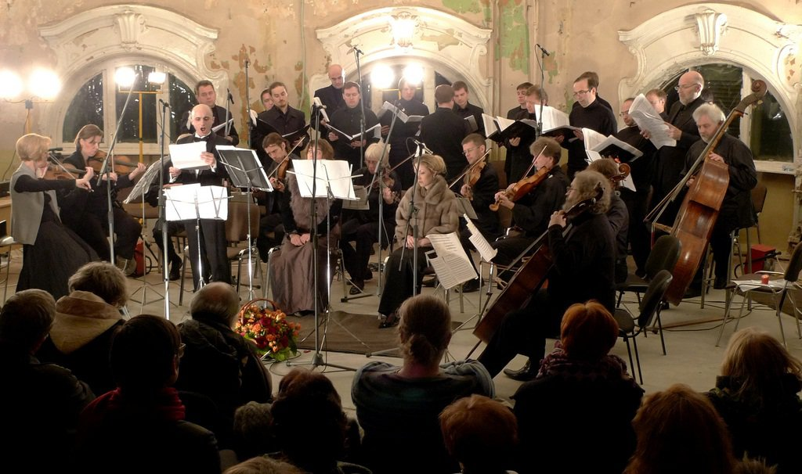

As practice shows, the imperishable world of art is also subject to whimsical fashion craze. The music theater being the top achievement of human mind in the field of the beautiful reflects all metamorphosis we see in the world. Minimalism and militarism, the main season trends, today reign both on runways and in the Russian contemporary opera. Parsimony of expression media in music, ascesis at the stage area, chamber cast and war of opinions roaring about the productions, domination of gray and grief about heroic past - these are the main components of the latest performances. 

<figure>
 
<figcaption> Exercises and Dancing of Guido. Photo is taken from <a href="https://www.snob.ru"> www.snob.ru</a> </figcaption>
</figure>

The year 2012 is notable for eruption of public interest about the sphere of musical theater. It first appeared during the *Golden Mask* Festival under the aegis of which a round table discussion "The contemporary theater needs contemporary opera" was held in spring. Hot discussion participated by famous music critics, directors and composers became the first large-scale attempt to understand the current situation of the music theater. Just then Vasiliy Barkhatov first announces about the foundation of the Operagroup and creation of pilot project - *Laboratory of Contemporary Opera* with the assistance of the Ministry of Culture of the RF. The art community activity has already resulted in staging of two productions: *Saint Francis* by Sergey Nevsky in the Bolshoi Theater and *Dreams of the Minotaur* by Olga Raeva in the Theater of Nations. By the end of this year we will see two other productions attracting with their extravagant concept and promising fascinating amusement of its implementation.
 

The other way to overcome the distance of contemporary academic music and audience this year was demonstrated by Vladimir Martynov. Supported by Private Non-Profit Cultural Establishment Sistema Gallery he organized a cycle of meetings titled *Vita Nova*. Acting as sophisticated gardener in the greenhouse, Martynov gradually prepared fertile ground to perceive his products telling stories from the history of arts. Together with Tatiana Grindenko and Opus Posth ensemble he nurtured his audience by masterly execution of his own compositions and Xenakis, Glass, Cage as well creating necessary cultural context and granting invaluable listener's experience.
 

The initial primary objective of the meetings was production of Martynov's long-suffering opera based on poem *Vita Nova* by Dante. For the first time in the history of contemporary academic music new marketing tool was used for this - crowd funding. The thing is about attraction of cash money to implement future project. The example of *Vita Nova* cycle has shown that today the direct contact with the audience is the most effective method. However, finally the meetings with Martynov and his music not only created the financial platform for the opera staging but formed a close-knit circle of adherents and amateurs of his art.
 

<h3>Seven notes - one Guido</h3>
<blockquote>
 <i> Thus I implored; and she, so far away,
Smiled, as it seemed, and looked once more at me;
Then unto the eternal fountain turned.
  </i> Divine Comedy, Dante</ 
 </blockquote>

 
Before diving into work on production of the *Vita Nova* the organizers gave the final reception in the Tower in Miluytinskiy pereulok. Though this extravagant venue is new at the cultural map of the capital it already attracts amateurs of unusual spaces and experimental art-objects who try to keep aloof of the traditional concert institute. That is what Ekaterina Kholm, the Director General of Sistema Gallery says about this: "My aesthetic spirit can hardly bear the concerts of classical music, this passive perception in the concert hall, this artificial situation. For about ten years I couldn't listen to the music though I myself am a musician and was born in musical family. Vladimir Martynov chased this sense away by peremptory repudiation of authorship. The composer's personality cult which presses on you, makes you obey, disappears, lacks at all. And for me the magic time came when I again could listen and hear the music."
 

<figure> 
<figcaption> <i>Saint Francis</i> opera by Sergey Nevsky in the Bolshoi Theater. Photo is taken from:  <a href="https://www.planeta.ru"> https://www.planeta.ru</a> </figcaption>  </figure> 

 

Arctic cold reigning under the arcs of the first Moscow skyscraper made the visitors wrap up the flaps of their military-style coats more tightly and hope for warming power of art. "Wonderful Apocalypse" mentioned in the inspirational introductory speech of the Vladimir Martynov seemed to come even today. The fiery speech of the musical philosopher pleaded to stop "talking horribly about horrible" as radical avant-garde composers did for the whole XX century. Martynov is looking for sources of future harmony in the far past art lying perdue in IX-X centuries when even the Apocalypse was shown beautifully and exceedingly expressively. This is not just a pose. That's conscious attitude. 
 

<figure> </img> <figcaption>V. Martynov. Photo is taken from:   <a href="https://www.planeta.ru"> https://www.planeta.ru</a> </figcaption> </figure> 

 

The evening event guests also included famous conductor __Vladimir Yurovsky__ in charge of the first concert execution of *Vita Nova* opera abroad. During the briefing maestro told about his attitude towards this "opera about opera": "To my mind, despite the monumentality of concept this work is absolutely chamber one. After execution of *Vita Nova* in New York I realized two things: first, this opera is not intended for concert execution, it deteriorates it, and, second, the audience, executors and especially critics shall really get ready to perceive this music. The foreign drama theaters use practice when after the final rehearsal the performance is executed for two weeks, sometimes even month. And this is called preview. Everybody except critics can see them. And only after that the first performance is given. If I had a carte-blanche I would do the same for *Vita Nova* with the exception of one detail - I would invite the critics but forbid them to write. The main aim today is to find appropriate premise for the opera first night. As well as in any mystery the *Vita Nova* has no divisions between participants and audience; everybody is involved. Wagner, when started to write his tetralogy, had the following plan initially: to construct theater on the Rhine bank specially for the performance, execute *The Ring* and burn the theater away. For me the ideal situation is performance in the frames of festival."
 

<figure> </img> <figcaption> Vladimir Yurovsky. Photo is taken from:  <a href="https://www.planeta.ru"> https://www.planeta.ru</a> </figcaption> </figure>  

 

To say a symbolic goodbye to the first season of the cycle they chose the concert execution of *Exercises and Dancing of Guido* opera by Vladimir Martynov written in 1997 on order of the German Sacro-Art-97 Festival. The opera character, Guido, is a kind of Moses of music. He came to this world to give a lesson. This is him who created musical staff and gave usual names to notes. But as understood by Martynov, Guido is a kind of anti-Messiah who started the decay, self-destruction of music.
 

Rough coloration of gregorian chant which opened the music spectacle fully corresponded to ascetic and ironic premise. This opera, written for choir, soloists and string ensemble with celesta, creates impression similar to feeling that you are standing in front of The *Last Supper* by Leonardo in Santa Maria della Grazie - a feeling of eternity.
 

The work of Martynov is a curious alloy of gregorian chants, baroque arias in the spirit of Handel and Bach, post-romantic cadences and rock riffs. Within one work Martynov combined centuries and styles into one music space. The conductors of this amazing travel in the waves of music memories were: soloists - charismatic tenor __Tigran Matinyan__, enchanting mezzo-soprano __Galina Muradova__ who participated in the first execution of this composition in Germany, and matted soprano __Lilia Gaisina, Masters of Choral Singing__ choir directed by __Lev Kontorovich__ and string ensemble of the __Academy of Ancient Music__ headed by __Tatiana Grigenko__.
 

Listening attentively to the final fading crystal passage you suddenly realize that if Walt Disney wanted to make cartoon film about Guido of Arezzo the music by Martynov would be ideal.
 

<h3>Postlude in three dialogs</h3>
 
Usual languid afterparty following the opera became a real culturological discourse. Some most interesting details appeared during the dialogs.
 
It turned out that fascination with works of Vladimir Martynov of contemporary Nadezhda von Meck, enthusiastic parton of arts Ekaterina Kholm, started with two works: Passionate songs and Stabat Mater: "I realized that music written by Vladimir Ivanovich is not music written by him; it's the music which shall be. It sounds and will sound like this, despite of our concerts. It shall not be considered from the point of view whether "this music will have its listener". No. It's we to discover it; it turns back to us. Our generation closed their hearts; we are afraid of pain, afraid of love, afraid of everything; and this music bring back understanding of simple and eternal truths."

 
__Vladimir Yurovsky__ also unveiled the intrigue of relations with music by Martynov: "My romantic story started from stage version of work *Lamentation of Jeremiah* by Vladimir Ivanovich shown in 1990-s in Berlin. It was a powerful impression for the whole life that is why I want *Vita Nova* to be staged so that the viewer would not remain indifferent." The maestro considers that first the listener shall be prepared to perceive  *Vita Nova* properly by first listening to music by Martynov and to all the baggage accumulated by centuries-long history of the West European music. 
 

__Vladimir Yurovsky:__ "The composer technique of Vladimir Ivanovich consists in creation of text about text, music about music. The main problem of listeners of the London first evening is that they were not ready. They perceived sweetest graces and roulades in good faith and did not hear the ironic commentary. Martynov is very easy to perceive and this is misinforming." 
 
 

<figure>
 </img> <figcaption>Soprano Lilia Gaisina. Photo is taken from:   <a href="https://www.planeta.ru"> https://www.planeta.ru</a> </figcaption> </figure> 

 
The thoughts expressed by maestro are energetically confirmed by Tatiana Grindenko according to whom "project of *Vita Nova* opera is just necessary for the Russian reality. Vladimir Ivanovich has a unique property: his music as if emits light. Our country really lacks this light - due to climate and moral reasons - and we shall give it chance to shine." 
 

All three agree that Martynov's music resembles sun sphere and a drop of melted gold. The music, unfolding, grants us the secret of distant stars. 
However, the cycles of thematic music evenings supported by Sistema Gallery are not over. Ekaterina Kholm looking like Turgenev's type girl shared the Gallery plans: "The near-term plans include evening devoted to music of American composer George Crump. Within the year we'll do rehearsals, select people for staging. We will struggle with Vladimir Ivanovich, make peace with Vladimir Ivanovich. The next series of meetings will be held in February at the background of artistic expositions. We will start with *Passionate Songs* by Martynov to be executed by Opus Posth ensemble. This is very strong, very powerful music. It has some imperial tint. That's the music to start the year of every man."

*The material is prepared by Elena Kravstun.*
